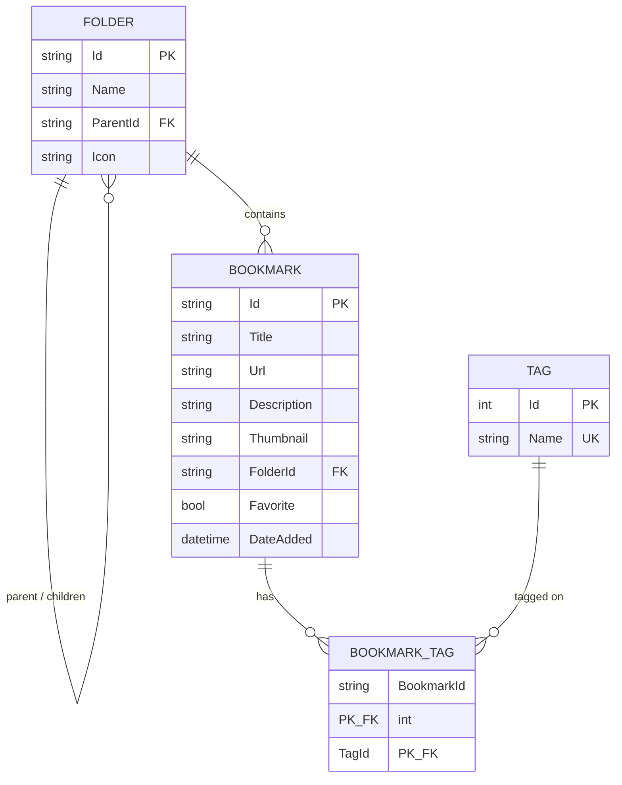

# Data model

## Entities

### Folder

A self-referencing tree. `ParentId` is nullable (top-level folders have none). Deleting a folder that still has bookmarks or subfolders returns `409 Conflict` unless the caller passes `?cascade=true`, which detaches (not deletes) its bookmarks and re-parents its subfolders to the folder's own parent. Deleting a folder that a bookmark points to via a foreign key sets `Bookmark.FolderId` to `null` at the database level (`OnDelete(DeleteBehavior.SetNull)`).

### Bookmark

The core entity. `Description` and `Thumbnail` default to an empty string rather than `null`. Belongs to at most one folder (optional) and any number of tags via the `BookmarkTag` join entity.

### Tag

A flat, globally unique (`Name` has a unique index) label. Tags are created on demand: when a bookmark request references a tag name that doesn't exist yet, `BookmarkService.SetTagsAsync` creates it. Tag names are trimmed and de-duplicated (case-sensitive) before persistence — see `Validation.NormalizeTags`.

### BookmarkTag

The many-to-many join entity between `Bookmark` and `Tag`, keyed on the composite `(BookmarkId, TagId)`. Both sides cascade-delete: removing a bookmark or a tag removes the corresponding join rows.

## Validation rules

| Field | Rule |
| :---- | :--- |
| `BookmarkRequest.Title` | Required, non-empty |
| `BookmarkRequest.Url` | Required, must be an absolute `http`/`https` URL (`AbsoluteUrlAttribute`) |
| `BookmarkRequest.FolderId` | If set, must reference an existing folder |
| `FolderRequest.Name` | Required, non-empty |
| `FolderRequest.ParentId` | If set, must reference an existing folder, and must not create a cycle |

Validation failures and "referenced entity not found" errors both surface as `400 Bad Request` with a `ValidationProblemDetails` body (see [Security]({{ site.baseurl }}/architecture/security/) for the full error-mapping table).
