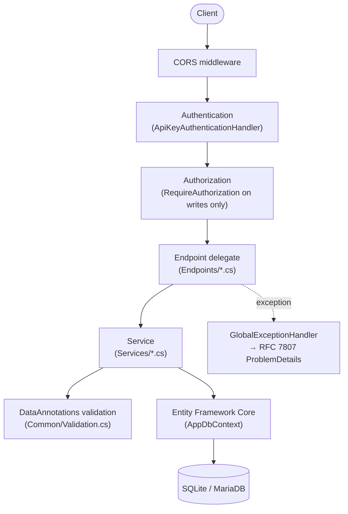
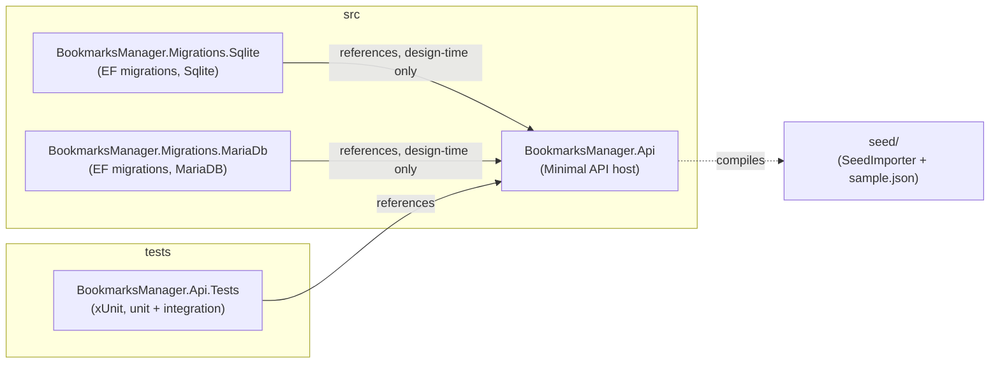

# Overview

## Request pipeline

Every request flows through the same ASP.NET Core Minimal API pipeline, regardless of endpoint:



`AuthN` always runs, but only endpoints marked `.RequireAuthorization()` (the write operations) actually enforce it — see [Security]({{ site.baseurl }}/architecture/security/).

## Project structure



Inside `BookmarksManager.Api`:

| Folder | Responsibility |
| :----- | :-------------- |
| `Endpoints/` | Minimal API route groups (`BookmarkEndpoints`, `FolderEndpoints`, `TagEndpoints`, `HealthEndpoints`) — routing and `RequireAuthorization()` placement only |
| `Services/` | Business logic and EF Core queries (`BookmarkService`, `FolderService`) |
| `Models/` | EF Core entities (`Bookmark`, `Folder`, `Tag`, `BookmarkTag`) |
| `Dtos/` | Request/response records used at the HTTP boundary |
| `Data/` | `AppDbContext`, `DatabaseProvider` (Sqlite/MariaDb switch), design-time `AppDbContextFactory` |
| `Auth/` | `ApiKeyAuthenticationHandler` and scheme constants |
| `Common/` | Cross-cutting concerns: validation, custom exceptions, `GlobalExceptionHandler` |

## Why two migrations projects?

EF Core migrations are provider-specific (SQLite and MariaDB generate different SQL), so each provider gets its own migrations assembly. `DatabaseProvider.Configure` points EF Core at the matching assembly based on `Database:Provider`, and `AppDbContextFactory` (used only by `dotnet ef migrations add` at design time) picks the same assembly via an `EF_PROVIDER` environment variable:

```bash
EF_PROVIDER=Sqlite  dotnet ef migrations add InitialCreate \
  --project src/BookmarksManager.Migrations.Sqlite \
  --startup-project src/BookmarksManager.Api

EF_PROVIDER=MariaDb dotnet ef migrations add InitialCreate \
  --project src/BookmarksManager.Migrations.MariaDb \
  --startup-project src/BookmarksManager.Api
```
