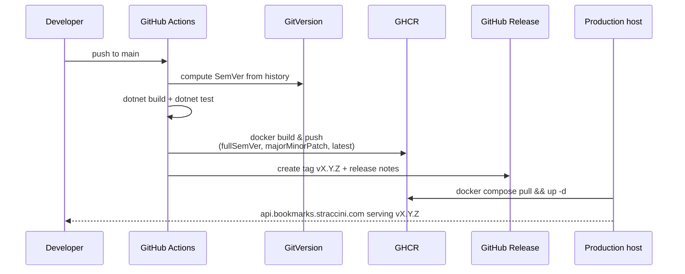

# Deployment

The production API is served from **[https://api.bookmarks.straccini.com](https://api.bookmarks.straccini.com)**.

1. [Docker & Compose]({{ site.baseurl }}/deployment/docker/) — the container image, `docker-compose.yml`, and the nginx reverse proxy in front of it
2. [CI/CD]({{ site.baseurl }}/deployment/ci-cd/) — how a push to `main` turns into a versioned image and a GitHub release

## At a glance

The last step (pulling the new image on the production host) is a deliberate manual/operator action, not an automated push-to-deploy from CI — see [CI/CD]({{ site.baseurl }}/deployment/ci-cd/) for why.
