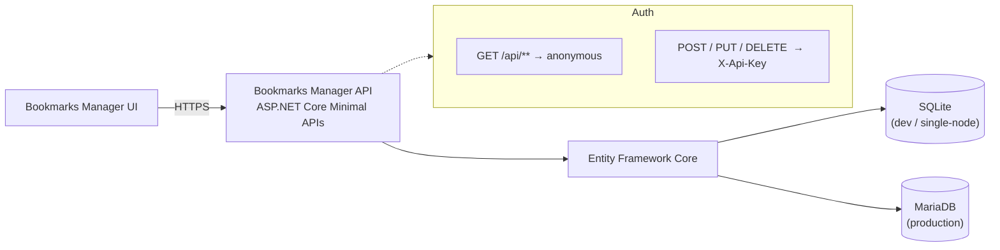

# 🗄️🔖 Bookmarks Manager API
{: .fs-9 }

A RESTful API for managing bookmarks, folders and tags, built with **.NET 10** and **ASP.NET Core Minimal APIs**.
{: .fs-6 .fw-300 }

[Get started now]({{ site.baseurl }}/getting-started/){: .btn .btn-primary .fs-5 .mb-4 .mb-md-0 .mr-2 }
[View on GitHub](https://github.com/guibranco/bookmarks-manager-api){: .btn .fs-5 .mb-4 .mb-md-0 }

---

## What is Bookmarks Manager API?

**Bookmarks Manager API** is the backend for the [Bookmarks Manager UI](https://github.com/guibranco/bookmarks-manager-ui). It lets you:

- 📂 **Organize bookmarks** into a nested folder tree
- 🏷 **Tag bookmarks** for cross-cutting search and filtering
- ⭐ **Mark favorites** for quick access
- 🌍 **Read without a key** — every `GET` endpoint is public
- 🔐 **Protect writes** — create/update/delete require an API key
- 🗃 **Run on SQLite or MariaDB** — pick the provider per environment

---

## Quick overview

---

## Feature highlights

| 🏷️ Feature | 📝 Description |
| :--------- | :------------- |
| **Public reads** | Every `GET` endpoint (bookmarks, folders, tags, health) requires no authentication |
| **API-key protected writes** | Create, update and delete require the `X-Api-Key` header |
| **Nested folders** | Folders can nest arbitrarily; cycle creation is rejected |
| **Cascading delete** | Deleting a folder can optionally detach its bookmarks/subfolders (`?cascade=true`) |
| **Tag normalization** | Tags are trimmed, de-duplicated and created on demand |
| **Problem Details errors** | Consistent RFC 7807 error responses for 400/404/409/500 |
| **Health check** | `/health` reports API and database connectivity |
| **Pluggable database** | Same codebase runs against SQLite or MariaDB via configuration |
| **OpenAPI / Swagger** | Interactive API docs in development (`/swagger`) |

---

## Technology stack

| Layer | Technology |
| :---- | :--------- |
| Runtime | .NET 10 / ASP.NET Core 10 (Minimal APIs) |
| Database | SQLite or MariaDB via Entity Framework Core 9 / Pomelo |
| Auth (management) | Custom `X-Api-Key` authentication handler |
| Validation | `System.ComponentModel.DataAnnotations` |
| Logging | Serilog (console + rolling file) |
| API docs | Swashbuckle / Swagger UI |
| Testing | xUnit, `Microsoft.AspNetCore.Mvc.Testing`, EF Core SQLite in-memory |
| Container | Docker / Docker Compose |
| CI/CD | GitHub Actions, GitVersion, SonarCloud |
| Docs | Jekyll + Just the Docs (this site) |

---

## Getting started

Head to [Installation]({{ site.baseurl }}/getting-started/installation/) to run the API locally in a few minutes, or read [Architecture]({{ site.baseurl }}/architecture/) to understand how everything fits together.

The production API is served from **[https://api.bookmarks.straccini.com](https://api.bookmarks.straccini.com)**.
